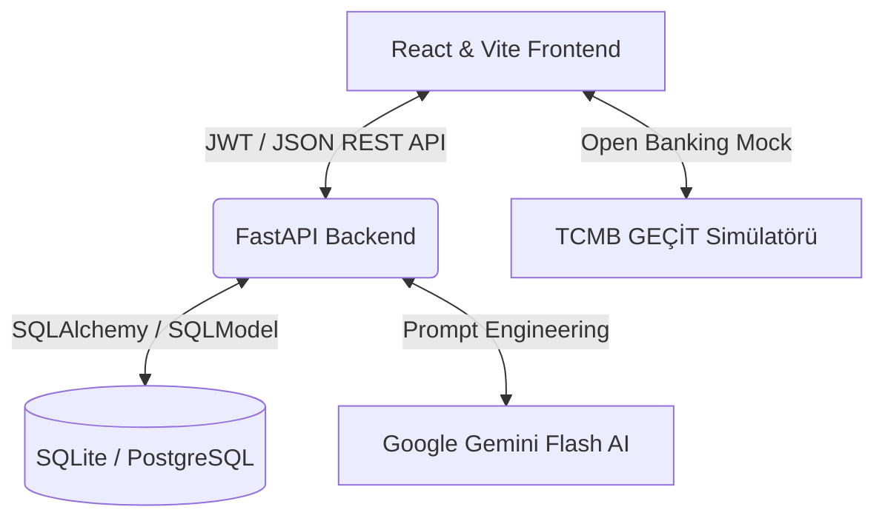

# 🚀 FinTwin AI — Yapay Zeka Destekli Dijital Finansal İkiz ve Açık Bankacılık Platformu

**FinTwin AI**, kullanıcıların harcama ve gelir alışkanlıklarını analiz ederek onların **"Dijital Finansal İkizini" (Financial Twin)** oluşturan, harcama duygu durumunu saptayan ve yapay zeka destekli kişiselleştirilmiş finansal mentorluk sunan yeni nesil bir otonom finansal yönetim platformudur.

---

## 🌟 Özellikler

### 1. 🤖 Dijital Finansal İkiz & AI Analiz Merkezi (Gemini AI)
* **Kişilik ve Ruh Hali Analizi (`Twin Mood`)**: İşlem geçmişinizi analiz ederek size özel finansal davranış profili (Örn: *Maaş Günü Riskli Harcayıcı*, *Dengeli Stratejist*) ve anlık ikiz ruh hali belirler.
* **Akıllı İçgörüler ve Aksiyon Planı**: Finansal sağlığınızı optimize etmek için yapay zeka tarafından özel üretilen maddeli tavsiyeler ve 3 ay sonraki tahmini bakiye projeksiyonu.
* **FinTwin Güven Skoru**: Harcamalarınızın sürdürülebilirliğine dayalı 0-100 arası finansal sağlık ve risk derecelendirmesi.

### 2. 🏦 Açık Bankacılık Simülatörü (Open Banking Connect)
* **TCMB / BKM GEÇİT Altyapı Uyumluluğu**: Sistem, kurum bağımsız hesap bilgisi sağlayıcısı (AISP) vizyonuyla tasarlanmıştır.
* **Tek Tıkla Senkronizasyon**: Demo ortamında *Akbank, Garanti BBVA, İş Bankası ve Yapı Kredi* simülasyonlarıyla tek tıkla 8 adet güncel ve gerçekçi harcamayı anında hesabınıza aktarır ve Yapay Zeka İkizini besler.

### 3. 🎯 Hedef Odaklı Akıllı Kumbara & AI İlerleyiş Takibi
* Hayalinizdeki hedefleri (Örn: *MacBook Pro - 60.000 TL* veya *Yurtdışı Tatili - 35.000 TL*) sisteme ekleyin.
* Yapay zeka arka planda aylık net tasarruf hızınızı hesaplayarak her hedefin altına özel bir tahmin ekler: *"Mevcut harcama hızınızla bu hedefe yaklaşık 4.5 ayda ulaşabilirsiniz."*
* Dinamik ilerleme çubuğuyla (`progress-bar`) kumbaraya anlık para ekleyip hedeflerinizi tamamlayın.

### 4. 🏆 Başarı Rozetleri
* Kullanıcıların bütçe disiplinini gerçek zamanlı takip eden dinamik rozet sistemi:
  * 🛡️ **Tasarruf Şövalyesi**: Toplam gelir toplam gideri aştığında.
  * ⚡ **Dürtü Avcısı**: Alışveriş harcamaları toplam giderin %25'inin altında kaldığında.
  * 🌟 **Sıfır Borç Kulübü**: Net bakiye sıfırın üzerinde olduğunda.
  * 🎯 **Hedef Uzmanı**: En az 1 aktif birikim hedefi oluşturulduğunda.
  * 👑 **FinTwin Master**: 5'ten fazla işlem kaydedip AI asistanı beslendiğinde.

### 5. 📑 Gelişmiş Filtreleme, Sıralama ve PDF Raporlama
* **Geçmiş İşlemler Merkezi**: İki tarih aralığı (`startDate` & `endDate`) seçimi, kategori filtrelemesi, anlık metin araması ve kronolojik (En Yeni/En Eski) sıralama kombinasyonları.
* **Rapor İndir (PDF Çıktısı)**: FinTwin analiz sonuçlarınızı, gelir-gider tablolarınızı ve bütçe dağılımınızı tek tıkla kurumsal ve düzenli bir PDF raporuna dönüştürür.

---

## 🏛️ Mimari ve Teknoloji Yığını



* **Frontend**: React 18, Vite, Lucide-React İkonları, Recharts (Dinamik Grafikler), jsPDF & AutoTable (Raporlama).
* **Backend**: Python 3.11, FastAPI, SQLModel (Pydantic + SQLAlchemy), Jose (JWT Kimlik Doğrulama), Google Generative AI (Gemini).
* **Veritabanı**: SQLModel ORM (Geliştirme için SQLite, Docker canlı ortamı için PostgreSQL uyumlu).
* **Dağıtım**: Tamamen Dockerize edilmiş altyapı (Docker Compose).

---

## 🚀 Kurulum ve Çalıştırma

### 🐳 Docker ile Tek Komutla Kurulum (Tavsiye Edilen)
Projedeki tüm servisleri (Veritabanı, Backend ve Frontend) tek komutla ayağa kaldırabilirsiniz:

```bash
docker compose up --build -d
```

* 🌐 **Frontend Web Arayüzü**: [http://localhost:3000](http://localhost:3000)
* ⚙️ **Backend API & Swagger Dokümantasyonu**: [http://localhost:8000/docs](http://localhost:8000/docs)

Konteynerleri durdurmak ve temizlemek için:
```bash
docker compose down
```

---

### 💻 Manuel Geliştirici Ortamı Kurulumu

#### 1. Backend Kurulumu
```bash
cd backend
python -m venv venv
source venv/bin/activate  
pip install -r requirements.txt
```
Backend dizininde bir `.env` dosyası oluşturun ve Gemini API anahtarınızı ekleyin:
```env
GEMINI_API_KEY=your_google_gemini_api_key
DATABASE_URL=sqlite:///./fintwin.db
SECRET_KEY=super_gizli_anahtar
```
```bash
uvicorn main:app --reload
```

#### 2. Frontend Kurulumu
Node.js 18+ gereklidir.
```bash
cd frontend
npm install
npm run dev
```
Uygulama `http://localhost:5173` adresinde çalışacaktır.
